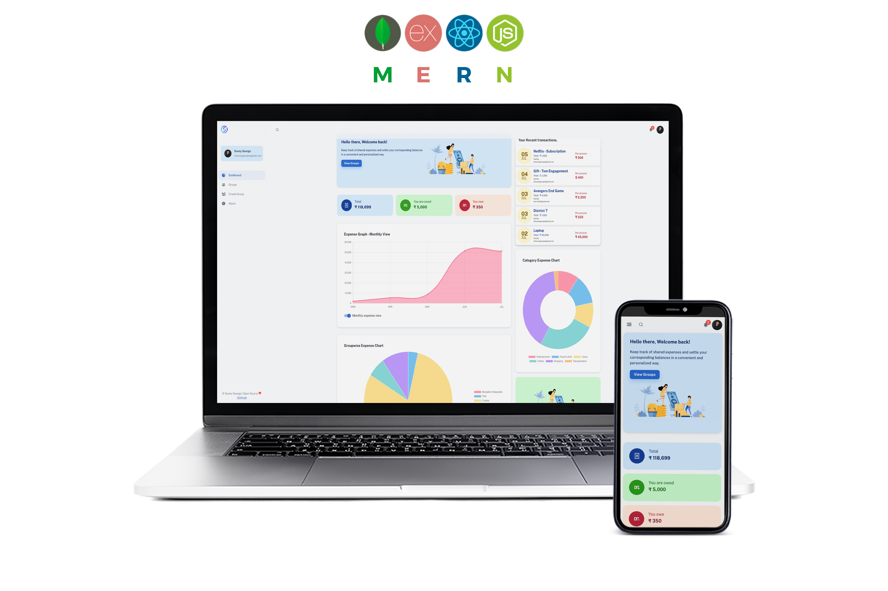

<div align="center">
  <a href="https://github.com/TanmayB5/SplitSphere">
    
  </a>
  <h2 align="center">SplitSphere</h2>
  <p align="center">
    A modern group expense splitting app built with the MERN stack (MongoDB, Express, React, Node.js).
    <br />
    <a href="https://github.com/TanmayB5/SplitSphere"><strong>Explore the code »</strong></a>
    <br />
    <br />
    <a href="http://localhost:3000">View Local Demo</a>
    ·
    <a href="https://github.com/TanmayB5/SplitSphere/issues">Report Bug</a>
    ·
    <a href="https://github.com/TanmayB5/SplitSphere/issues">Request Feature</a>
  </p>
</div>


## Group Expense Splitting Application

  * [Introduction](#introduction)
  * [Key Features](#key-features)
  * [Technologies used](#technologies-used)
      - [Frontend](#frontend)
      - [Backend](#backend)
      - [Database](#database)
  * [Configuration and Setup](#configuration-and-setup)
  * [License](#license)


## Introduction
SplitSphere is a full-stack expense splitting app (Splitwise clone) made using the MERN stack (MongoDB, Express, React & Node.js), designed to help groups of friends manage and settle shared expenses. The app provides analytics such as group balances, monthly spending, and category-wise breakdowns.

- This repository contains both the backend (Node.js/Express) and frontend (React) code.
- You can run the app locally or deploy it to your preferred platform.


## Key Features
- Create and manage user groups
- Add and track shared expenses
- Settle up balances between group members
- Visual analytics: group balance, monthly spend, category-wise graphs
- User authentication (JWT-based)
- Responsive UI with Material UI
- Secure password storage (bcryptjs)

## Technologies Used

### Frontend
- React.js
- Redux
- Axios
- Material UI
- Chart.js & react-chartjs-2
- Gravatar

### Backend
- Node.js & Express
- Mongoose (MongoDB ODM)
- JWT (Authentication)
- bcryptjs (Password hashing)
- Winston, Morgan (Logging)

### Database
- MongoDB (Atlas or local)

## Getting Started (Local Setup)

1. **Clone the repository:**
   ```sh
   git clone https://github.com/TanmayB5/SplitSphere.git
   cd SplitSphere
   ```

2. **Install backend dependencies:**
   ```sh
   npm install
   ```

3. **Configure environment variables:**
   - Create a `.env` file in the root directory:
     ```env
     PORT=3001
     MONGODB_URI=your_mongodb_connection_string
     ACCESS_TOKEN_SECRET=your_secret_key
     ```
   - To generate a random secret key:
     ```sh
     node -e "console.log(require('crypto').randomBytes(256).toString('base64'));"
     ```

4. **Start the backend server:**
   ```sh
   npm start
   # The backend will run on http://localhost:3001
   ```

5. **Install frontend dependencies and start the client:**
   ```sh
   cd client
   npm install
   npm start
   # The frontend will run on http://localhost:3000
   ```

- The React app proxies API requests to the backend at port 3001 (see `client/package.json` for the proxy setting).
- Make sure both servers are running for full functionality.

## Project Structure
- `client/` - React frontend
- `routes/`, `model/`, `helper/`, `components/` - Node.js backend
- `.env` - Environment variables for backend
- `Procfile` - For deployment (Heroku etc.)

## Deployment
- The app can be deployed on any platform supporting Node.js (Heroku, Render, etc.).
- For production, build the React app (`npm run build` in `client/`) and serve it from the backend.

## Notes
- If you see proxy errors in the React app, make sure your backend server is running on port 3001.
- For any issues or feature requests, please use the GitHub Issues page.
- Contributions are welcome! Feel free to fork and submit pull requests.

## License

This project is MIT licensed.

Copyright 2022-2025 TanmayB5

THE SOFTWARE IS PROVIDED "AS IS", WITHOUT WARRANTY OF ANY KIND, EXPRESS OR IMPLIED, INCLUDING BUT NOT LIMITED TO THE WARRANTIES OF MERCHANTABILITY, FITNESS FOR A PARTICULAR PURPOSE AND NONINFRINGEMENT. IN NO EVENT SHALL THE AUTHORS OR COPYRIGHT HOLDERS BE LIABLE FOR ANY CLAIM, DAMAGES OR OTHER LIABILITY, WHETHER IN AN ACTION OF CONTRACT, TORT OR OTHERWISE, ARISING FROM, OUT OF OR IN CONNECTION WITH THE SOFTWARE OR THE USE OR OTHER DEALINGS IN THE SOFTWARE.
